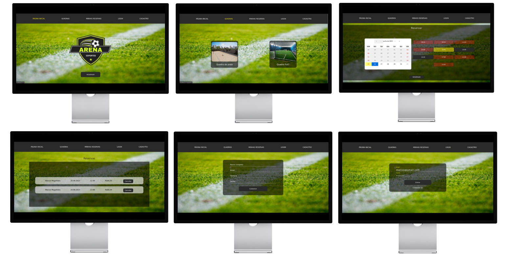

# Arena Esportes

Esta é uma aplicação para web desenvolvida para gerenciar reservas de quadras esportivas. Os usuários podem se cadastrar, fazer login e escolher o dia e horário desejados para agendar seus jogos. O objetivo é facilitar e modernizar a marcação de aluguéis de quadras esportivas.



Este projeto faz parte do meu portfólio pessoal.    

## Funcionalidades

- Cadastro e login de usuário
- Vizualização de quadras esportivas disponíveis
- Vizualização de datas e horários disponivel para cada quadra
- Realização de reserva de aluguel de quadra
- Vizualiação de reservas realizadas pelo usuário logado
- Cancelamento de reservas

## Desenvolvimento
As seguintes ferramentas foram utilizados na construção do projeto:
<p>
  
  
  
  
  
  
  
  
  
  
  
</p>

## Iniciando

### Instalação

1. Clone a pasta back-end disponível neste repositório.
2. Instale as dependências:
```bash
npm i
```
3. Crie um banco de dados PostgreSQL com o nome de sua preferência utilizando prisma.schema.
4. Crie um arquivo .env na raiz do projeto e defina as variáveis de ambiente conforme arquivo .env.example 
5. Rode o back-end através do comando:
```bash
npm run dev
```
6. Seu servidor estará em execucução.
7. Clone a pasta front-end disponível neste repositório.
8. Instale as dependências:
```bash
npm i
```
9. Crie um arquivo .env na raiz do projeto conforme o arquivo .env.example e defina a variável de ambiente VITE_API_BASE_URL de acordo com a porta em que o back-end estiver rodando em seu computador. Exemplo: 
```bash
VITE_API_BASE_URL=//localhost:5001 // coloque a porta escolhida no arquivo .env do back-end
```
10. Rode o front-end através do comando:
```bash
npm run dev
```
11. Finalmente, acesse http://localhost:5173 através do seu browser
